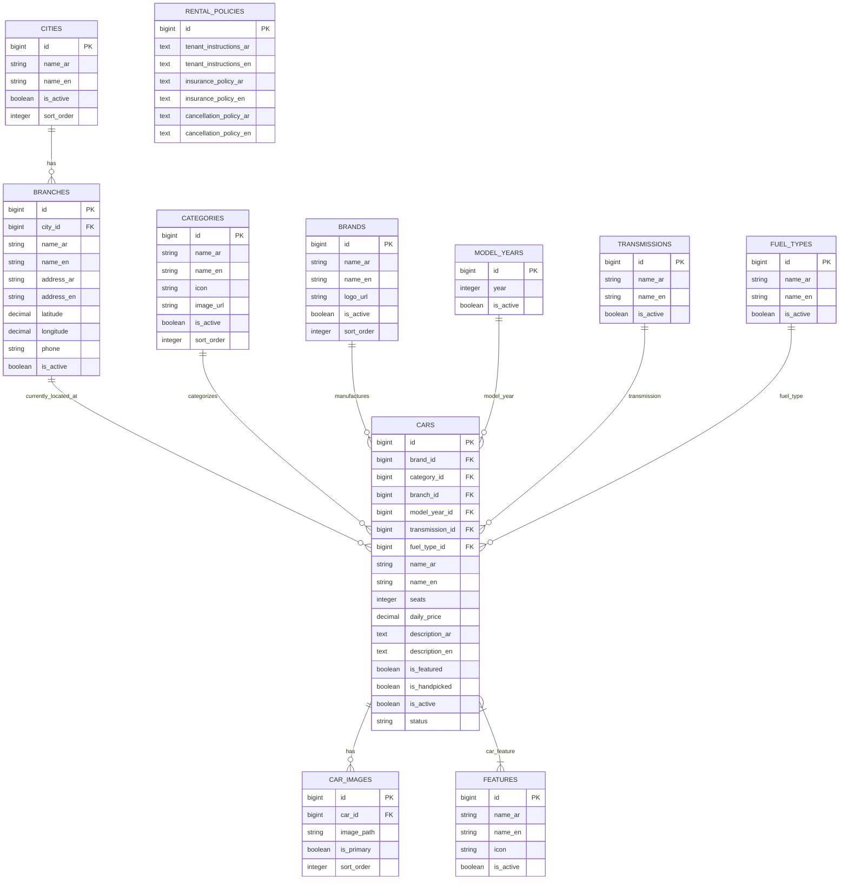

# BenHady — Home & CarDetails Modules Specification (`modules.md`)

This document presents the authoritative specification and database architecture for the **Home** and **CarDetails** modules of the BenHady (بن هادي) car rental platform, extracted directly from the Figma design system (`N2tSZc37X7fZhp44AI6P6I`) and refined based on business requirements.

---

## 1. Overview & UI/UX Features

### 1.1 Home Module (`Home/BeforeLogin`, `Home/AfterLogin`)
- **Header & Location Selector**:
  - Greeting text (`أهلاً وسهلاً`, `ضيفنا العزيز` / user name `أحمد التطاوي`).
  - Active City Dropdown (`الرياض`, `جدة`, etc.) allowing users to filter inventory by city.
  - Notification icon with real-time unread badge count.
  - Search bar input trigger (`ابحث عن سياراتك...`).
- **Car Categories Grid (`تصنيفات السيارات`)**:
  - Economy (`اقتصادية`), Family (`عائلية`), 4x4 / SUV (`دفع رباعي`), Luxury (`فخمة`), etc.
- **Brand Quick-Filter (`الماركات / الموردين`)**:
  - Visual brand logo chips (Toyota, Nissan, Hyundai, BMW, Tesla, Honda, Mercedes-Benz).
- **Featured & Handpicked Cars (`اخترنا لك بعناية` / `أحدث الإضافات`)**:
  - Car cards showcasing primary image, brand logo, title (e.g. `مرسيدس E-Class`), model year (`2022`/`2024`), daily price (`500 ر.س / اليوم`), specs chips (Seats `4 مقاعد`, Fuel `بنزين`, Transmission `أوتوماتيك`), and details button (`تفاصيل`).

### 1.2 Car Details & Catalog Module (`Cars/CarDetails`, `Cars/AllCars`, `Cars/Search`)
- **Catalog & Search Filter (`Cars/AllCars`, `Cars/Search`)**:
  - Search by keyword, brand, category, city/branch, model year, transmission, fuel type, seating capacity, price range.
- **Car Overview & Gallery (`Cars/CarDetails`)**:
  - Multi-image gallery carousel (`CarImage` stored in `storage/app/public/cars/`).
  - Brand badge, category, model year, daily rental price (`ر.س / اليوم`).
  - Quick specs bar: Transmission (`أوتوماتيك`), Fuel type (`بنزين`), Seating capacity (`4 مقاعد`).
- **Features & Amenities (`المميزات`)**:
  - Feature badges: Bluetooth (`بلوتوث`), GPS (`نظام ملاحة GPS`), Sunroof (`فتحة سقف`), Leather Seats (`مقاعد جلدية`), Rear Camera (`كاميرا خلفية`), etc.
- **Branch Location (`الفرع الموجودة به السيارة`)**:
  - Direct branch location where the car is physically parked (e.g., `الرياض , فرع رقم 1`).
  - Location button (`عرض الموقع`) with map coordinates.
  - *Dynamic Relocation*: When a car is rented and returned to another branch, its `branch_id` is automatically updated to the receiving branch.
- **Description & Public Policies (`وصف السيارة والسياسات العامة`)**:
  - Detailed description text specific to the car.
  - **General Public Policies** (shared across all cars, fetched from `rental_policies` table):
    - Tenant instructions (`تعليمات المستأجر`).
    - Insurance policy (`سياسة التأمين`).
    - Cancellation policy (`سياسة الإلغاء`).
- **Booking Call-to-Action (`احجز الآن`)**:
  - Direct trigger to date selection and checkout flow.

---

## 2. Database Schema & Architecture



---

## 3. Database Table Specifications

### 3.1 `cities`
| Column | Type | Constraints | Description |
|---|---|---|---|
| `id` | `bigint` | `PRIMARY KEY, AUTO_INCREMENT` | City ID |
| `name_ar` | `varchar(255)` | `NOT NULL` | Arabic city name (e.g. الرياض) |
| `name_en` | `varchar(255)` | `NOT NULL` | English city name (e.g. Riyadh) |
| `is_active` | `boolean` | `DEFAULT true` | Active visibility flag |
| `sort_order` | `integer` | `DEFAULT 0` | Display sorting priority |

### 3.2 `branches`
| Column | Type | Constraints | Description |
|---|---|---|---|
| `id` | `bigint` | `PRIMARY KEY, AUTO_INCREMENT` | Branch ID |
| `city_id` | `bigint` | `FOREIGN KEY (cities.id)` | Parent City ID |
| `name_ar` | `varchar(255)` | `NOT NULL` | Arabic branch name (e.g. فرع رقم 1) |
| `name_en` | `varchar(255)` | `NOT NULL` | English branch name |
| `address_ar` | `varchar(255)` | `NOT NULL` | Arabic address string |
| `address_en` | `varchar(255)` | `NOT NULL` | English address string |
| `latitude` | `decimal(10,7)` | `NULLABLE` | Geo latitude |
| `longitude` | `decimal(10,7)` | `NULLABLE` | Geo longitude |
| `phone` | `varchar(255)` | `NULLABLE` | Contact phone number |
| `is_active` | `boolean` | `DEFAULT true` | Branch status |

### 3.3 `categories`
| Column | Type | Constraints | Description |
|---|---|---|---|
| `id` | `bigint` | `PRIMARY KEY, AUTO_INCREMENT` | Category ID |
| `name_ar` | `varchar(255)` | `NOT NULL` | e.g., اقتصادية, عائلية, دفع رباعي |
| `name_en` | `varchar(255)` | `NOT NULL` | e.g., Economy, Family, SUV |
| `icon` | `varchar(255)` | `NULLABLE` | Icon identifier |
| `image_url` | `varchar(255)` | `NULLABLE` | Category image in storage |
| `is_active` | `boolean` | `DEFAULT true` | Status |
| `sort_order` | `integer` | `DEFAULT 0` | Display order |

### 3.4 `brands`
| Column | Type | Constraints | Description |
|---|---|---|---|
| `id` | `bigint` | `PRIMARY KEY, AUTO_INCREMENT` | Brand ID |
| `name_ar` | `varchar(255)` | `NOT NULL` | e.g., مرسيدس, تويوتا, نيسان |
| `name_en` | `varchar(255)` | `NOT NULL` | e.g., Mercedes-Benz, Toyota |
| `logo_url` | `varchar(255)` | `NULLABLE` | Brand logo image in storage |
| `is_active` | `boolean` | `DEFAULT true` | Status |
| `sort_order` | `integer` | `DEFAULT 0` | Display order |

### 3.5 `model_years` *(Lookup Table)*
| Column | Type | Constraints | Description |
|---|---|---|---|
| `id` | `bigint` | `PRIMARY KEY, AUTO_INCREMENT` | ID |
| `year` | `integer` | `NOT NULL, UNIQUE` | Manufacturing year (e.g. 2022, 2024, 2025) |
| `is_active` | `boolean` | `DEFAULT true` | Active flag |

### 3.6 `transmissions` *(Lookup Table)*
| Column | Type | Constraints | Description |
|---|---|---|---|
| `id` | `bigint` | `PRIMARY KEY, AUTO_INCREMENT` | ID |
| `name_ar` | `varchar(255)` | `NOT NULL` | e.g., أوتوماتيك, يدوي (عادي), CVT |
| `name_en` | `varchar(255)` | `NOT NULL` | e.g., Automatic, Manual, CVT |
| `is_active` | `boolean` | `DEFAULT true` | Active flag |

### 3.7 `fuel_types` *(Lookup Table)*
| Column | Type | Constraints | Description |
|---|---|---|---|
| `id` | `bigint` | `PRIMARY KEY, AUTO_INCREMENT` | ID |
| `name_ar` | `varchar(255)` | `NOT NULL` | e.g., بنزين, ديزل, كهرباء, هايبرد |
| `name_en` | `varchar(255)` | `NOT NULL` | e.g., Gasoline, Diesel, Electric, Hybrid |
| `is_active` | `boolean` | `DEFAULT true` | Active flag |

### 3.8 `features`
| Column | Type | Constraints | Description |
|---|---|---|---|
| `id` | `bigint` | `PRIMARY KEY, AUTO_INCREMENT` | Feature ID |
| `name_ar` | `varchar(255)` | `NOT NULL` | e.g., بلوتوث, نظام ملاحة GPS, فتحة سقف |
| `name_en` | `varchar(255)` | `NOT NULL` | e.g., Bluetooth, GPS Navigation, Sunroof |
| `icon` | `varchar(255)` | `NULLABLE` | Icon SVG/component key |
| `is_active` | `boolean` | `DEFAULT true` | Active status |

### 3.9 `cars`
| Column | Type | Constraints | Description |
|---|---|---|---|
| `id` | `bigint` | `PRIMARY KEY, AUTO_INCREMENT` | Car ID |
| `brand_id` | `bigint` | `FOREIGN KEY (brands.id)` | Brand reference |
| `category_id` | `bigint` | `FOREIGN KEY (categories.id)` | Category reference |
| `branch_id` | `bigint` | `FOREIGN KEY (branches.id)` | Current branch where car is located |
| `model_year_id` | `bigint` | `FOREIGN KEY (model_years.id)` | Year of manufacture |
| `transmission_id` | `bigint` | `FOREIGN KEY (transmissions.id)` | Transmission type |
| `fuel_type_id` | `bigint` | `FOREIGN KEY (fuel_types.id)` | Fuel type |
| `name_ar` | `varchar(255)` | `NOT NULL` | Arabic car model name (e.g. مرسيدس E-Class) |
| `name_en` | `varchar(255)` | `NOT NULL` | English car model name (e.g. Mercedes E-Class) |
| `seats` | `integer` | `DEFAULT 5` | Number of seats |
| `daily_price` | `decimal(10,2)` | `NOT NULL` | Daily rental price in SAR |
| `description_ar` | `text` | `NULLABLE` | Detailed Arabic car description |
| `description_en` | `text` | `NULLABLE` | Detailed English car description |
| `is_featured` | `boolean` | `DEFAULT false` | Display in featured carousel |
| `is_handpicked` | `boolean` | `DEFAULT false` | Display in handpicked section |
| `is_active` | `boolean` | `DEFAULT true` | Overall car visibility |
| `status` | `varchar(255)` | `DEFAULT 'available'` | Car status handled by `CarStatusEnum` (`available`, `rented`, `maintenance`, `reserved`) |

### 3.10 `car_images`
| Column | Type | Constraints | Description |
|---|---|---|---|
| `id` | `bigint` | `PRIMARY KEY, AUTO_INCREMENT` | Image ID |
| `car_id` | `bigint` | `FOREIGN KEY (cars.id), ON DELETE CASCADE` | Associated Car |
| `image_path` | `varchar(255)` | `NOT NULL` | File path in `storage/` (e.g., `cars/camry_1.jpg`) |
| `is_primary` | `boolean` | `DEFAULT false` | Main display thumbnail |
| `sort_order` | `integer` | `DEFAULT 0` | Gallery sequence |

### 3.11 `car_feature` *(Pivot)*
| Column | Type | Constraints | Description |
|---|---|---|---|
| `car_id` | `bigint` | `FOREIGN KEY (cars.id), ON DELETE CASCADE` | Car ID |
| `feature_id` | `bigint` | `FOREIGN KEY (features.id), ON DELETE CASCADE` | Feature ID |

### 3.12 `rental_policies` *(Single Row Global Settings)*
| Column | Type | Constraints | Description |
|---|---|---|---|
| `id` | `bigint` | `PRIMARY KEY, AUTO_INCREMENT` | Policy record ID |
| `tenant_instructions_ar` | `text` | `NOT NULL` | Arabic tenant instructions (تعليمات المستأجر) |
| `tenant_instructions_en` | `text` | `NULLABLE` | English tenant instructions |
| `insurance_policy_ar` | `text` | `NOT NULL` | Arabic insurance coverage policy (سياسة التأمين) |
| `insurance_policy_en` | `text` | `NULLABLE` | English insurance coverage policy |
| `cancellation_policy_ar` | `text` | `NOT NULL` | Arabic cancellation terms (سياسة الإلغاء) |
| `cancellation_policy_en` | `text` | `NULLABLE` | English cancellation terms |

---

## 4. Enums Specification

### `CarStatusEnum` (`app/Enums/Car/CarStatusEnum.php`)
```php
namespace App\Enums\Car;

enum CarStatusEnum: string
{
    case AVAILABLE = 'available';     // متاحة للإيجار
    case RENTED = 'rented';           // مؤجرة حالياً
    case MAINTENANCE = 'maintenance'; // في الصيانة
    case RESERVED = 'reserved';       // محجوزة
}
```

---

## 5. Storage & Image Handling
All images (car photos, brand logos, category images) are stored in the local disk (`storage/app/public/`) with symlink to `public/storage/`:
- Cars gallery: `storage/app/public/cars/`
- Brand logos: `storage/app/public/brands/`
- Category icons: `storage/app/public/categories/`

In API responses, images return full public URLs using Laravel's asset helper (`asset('storage/' . $path)`).

---

## 6. Seeders Strategy
1. **`RentalPolicySeeder`**: Seeds exactly 1 initial record with standard Saudi rental guidelines, comprehensive insurance terms, and free/flexible cancellation policies.
2. **`CityAndBranchSeeder`**: Seeds major Saudi cities (الرياض, جدة, الدمام, الخبر) and active branches with coordinates and phone numbers.
3. **`LookupSeeder`**: Seeds:
   - `model_years`: 2020 through 2026.
   - `transmissions`: أوتوماتيك (Automatic), يدوي (Manual), CVT.
   - `fuel_types`: بنزين 91, بنزين 95, ديزل, كهرباء, هايبرد.
4. **`CategoryAndBrandSeeder`**: Seeds economy, family, SUV, luxury categories, and top manufacturers (Toyota, Hyundai, Mercedes, BMW, Nissan).
5. **`FeatureSeeder`**: Seeds common amenities (GPS, Bluetooth, Sunroof, Leather Seats, Rear Camera).
6. **`CarSeeder`**: Seeds real cars mapped to specific branches, lookup IDs, features, and storage images.

---

## 7. RESTful API Architecture

Following the Clean Architecture rules in `AGENTS.md`:

```
Route -> Middleware -> FormRequest -> Controller -> DTO -> Service -> Repository -> Model -> ApiResponse
```

### 7.1 Endpoints Specification

| Method | Endpoint | Description | Auth Required |
|---|---|---|---|
| `GET` | `/api/home` | Aggregated home payload (Categories, Brands, Featured Cars, Handpicked Cars) | Optional |
| `GET` | `/api/cities` | List active cities & their branches | Optional |
| `GET` | `/api/cars` | Filtered car catalog (Search by keyword, brand_id, category_id, city_id, branch_id, model_year_id, transmission_id, fuel_type_id, price range) | Optional |
| `GET` | `/api/cars/{id}` | Complete car detail payload (Gallery, Features, Current Branch, Global Policies) | Optional |
| `GET` | `/api/policies` | Retrieve general rental, insurance, and cancellation policies | Optional |
